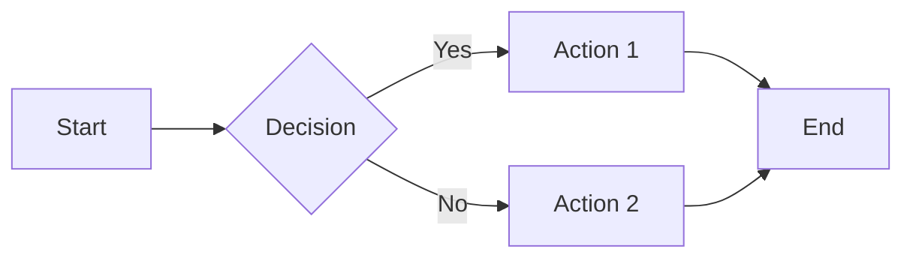

# Material for MkDocs Features

This document lists all the Material for MkDocs features enabled in this documentation.

## Theme Features

### Navigation

- ✅ **navigation.tabs** - Top-level sections as tabs
- ✅ **navigation.tabs.sticky** - Tabs remain visible when scrolling
- ✅ **navigation.sections** - Render top-level sections as groups
- ✅ **navigation.expand** - Expand all collapsible sections by default
- ✅ **navigation.path** - Show breadcrumb navigation path
- ✅ **navigation.indexes** - Section index pages (index.md)
- ✅ **navigation.top** - "Back to top" button
- ✅ **navigation.footer** - Previous/next page footer navigation
- ✅ **navigation.tracking** - Anchor tracking in URL

### Table of Contents

- ✅ **toc.follow** - Sidebar scrolls to active anchor
- ✅ **toc.integrate** - Integrate TOC into navigation

### Search

- ✅ **search.suggest** - Search suggestions
- ✅ **search.highlight** - Highlight search terms
- ✅ **search.share** - Share search query via URL

### Content

- ✅ **content.code.copy** - Copy button for code blocks
- ✅ **content.code.annotate** - Code annotations (1)
- ✅ **content.tabs.link** - Link content tabs across page
- ✅ **content.tooltips** - Tooltips on hover

### Header

- ✅ **header.autohide** - Auto-hide header on scroll

### Announcement Bar

- ✅ **announce.dismiss** - Dismissible announcement bar

## Markdown Extensions

### Python Markdown

- ✅ **abbr** - Abbreviations with tooltips (see includes/abbreviations.md)
- ✅ **admonition** - Call-out boxes (!!! note, !!! warning, etc.)
- ✅ **attr_list** - Add HTML attributes to Markdown elements
- ✅ **def_list** - Definition lists
- ✅ **footnotes** - Footnotes[^1]
- ✅ **md_in_html** - Markdown inside HTML
- ✅ **tables** - Tables
- ✅ **toc** - Table of contents with permalinks

### PyMdown Extensions

- ✅ **pymdownx.arithmatex** - LaTeX math with MathJax: $E=mc^2$
- ✅ **pymdownx.betterem** - Improved emphasis
- ✅ **pymdownx.caret** - Insert (^^underline^^) and superscript (^super^)
- ✅ **pymdownx.mark** - Highlight text (==marked==)
- ✅ **pymdownx.tilde** - Delete (~~strikethrough~~) and subscript (~sub~)
- ✅ **pymdownx.critic** - Track changes {--delete--} {++add++}
- ✅ **pymdownx.details** - Collapsible admonitions (??? note)
- ✅ **pymdownx.emoji** - Emoji support :smile: :material-account:
- ✅ **pymdownx.highlight** - Syntax highlighting
- ✅ **pymdownx.inlinehilite** - Inline code highlighting
- ✅ **pymdownx.keys** - Keyboard keys ++ctrl+c++
- ✅ **pymdownx.magiclink** - Auto-link URLs and repos
- ✅ **pymdownx.smartsymbols** - Smart symbols (c) (tm) (r) --> © ™ ®
- ✅ **pymdownx.snippets** - Include external files
- ✅ **pymdownx.superfences** - Nested code blocks and custom fences
  - Mermaid diagrams
  - Custom code blocks
- ✅ **pymdownx.tabbed** - Tabbed content (=== "Tab 1")
- ✅ **pymdownx.tasklist** - Task lists with checkboxes

## Plugins

- ✅ **search** - Enhanced search with better tokenization
- ✅ **mkdocstrings** - API documentation from docstrings
- ✅ **git-revision-date-localized** - Show last update time

## Extra Features

### Social Links

- :fontawesome-brands-github: GitHub
- :fontawesome-brands-python: PyPI
- :fontawesome-solid-paper-plane: Email

### Icons

- Material Design Icons (`:material-*:`)
- FontAwesome (`:fontawesome-*:`)
- Octicons (`:octicons-*:`)

### Analytics (Optional)

- Google Analytics with feedback widget

### Versioning

- Mike for version management (if needed)

## Examples

### Admonitions

!!! note "This is a note"
    This is the content of the note.

!!! warning "This is a warning"
    This is the content of the warning.

!!! tip "Pro Tip"
    This is a helpful tip.

!!! example "Example"
    This is an example.

!!! abstract "Summary"
    This is a summary.

??? info "Collapsible Info"
    This content is hidden by default.

### Tabs

=== "Tab 1"
    Content for tab 1

=== "Tab 2"
    Content for tab 2

=== "Tab 3"
    Content for tab 3

### Grid Cards

<div class="grid cards" markdown>

-   :material-clock-fast: __Fast__

    ---

    Get up and running quickly

-   :material-palette: __Beautiful__

    ---

    Material Design aesthetics

-   :material-rocket-launch: __Powerful__

    ---

    Full-featured documentation

</div>

### Task Lists

- [x] Task 1 completed
- [x] Task 2 completed
- [ ] Task 3 pending
- [ ] Task 4 pending

### Math

Inline math: $E = mc^2$

Block math:

$$
\nabla \times \mathbf{E} = -\frac{\partial \mathbf{B}}{\partial t}
$$

### Keyboard Keys

Press ++ctrl+c++ to copy and ++ctrl+v++ to paste.

### Text Formatting

- **Bold text**
- *Italic text*
- ==Highlighted text==
- ^^Inserted text^^
- ~~Deleted text~~
- H~2~O (subscript)
- x^2^ (superscript)

### Footnotes

This is a sentence with a footnote.[^1]

[^1]: This is the footnote content.

### Abbreviations

The RCWA method (hover to see definition) is implemented in GRCWA.

### Critic Markup

{--Removed text--}

{++Added text++}

{~~Old~>New~~}

{==Highlighted==}

{>>Comment<<}

### Buttons

[Primary Button](#){ .md-button .md-button--primary }
[Regular Button](#){ .md-button }

### Mermaid Diagrams



### Code Annotations

```python
def hello_world():  # (1)!
    print("Hello, World!")  # (2)!
```

1. This defines a function
2. This prints a message

## Custom CSS Classes

### Text Alignment

<div class="text-center" markdown>
This text is centered
</div>

<div class="text-right" markdown>
This text is right-aligned
</div>

### Highlight Box

<div class="highlight-box" markdown>
This is a highlighted box with special styling.
</div>

## Responsive Design

The documentation is fully responsive and works on:

- 🖥️ Desktop (1920px+)
- 💻 Laptop (1366px - 1920px)
- 📱 Tablet (768px - 1366px)
- 📱 Mobile (< 768px)

## Dark Mode

Toggle between light and dark themes using the button in the header.

- Light mode: Clean, bright interface
- Dark mode: Easy on the eyes for night reading

## Accessibility

- ♿ Keyboard navigation
- 🔍 High contrast mode support
- 📖 Screen reader friendly
- 🎯 Focus indicators
- 📝 Semantic HTML

---

For more information, see the [Material for MkDocs documentation](https://squidfunk.github.io/mkdocs-material/).
