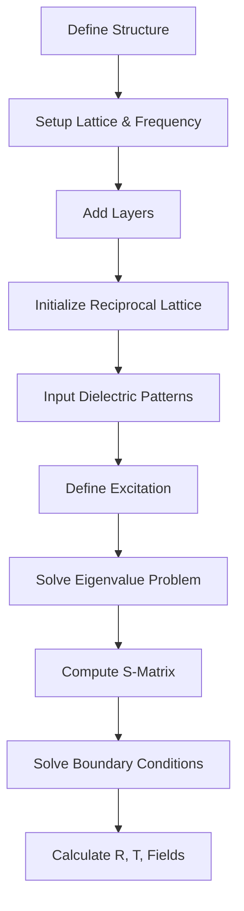

# Introduction to RCWA

## What is Rigorous Coupled Wave Analysis?

**Rigorous Coupled Wave Analysis (RCWA)**, also known as **Fourier Modal Method (FMM)**, is a semi-analytical method for solving Maxwell's equations in periodic structures. It's one of the most widely used techniques for analyzing electromagnetic wave interaction with periodic photonic structures such as:

- **Diffraction gratings**: Used in spectrometers, wavelength division multiplexers
- **Photonic crystals**: Band gap materials for controlling light propagation
- **Metasurfaces**: Subwavelength structured surfaces for wavefront control
- **Solar cells**: Periodic textures for light trapping
- **Anti-reflection coatings**: Moth-eye structures
- **Optical filters**: Wavelength-selective devices

## Why RCWA?

### Advantages

**Rigorous Solution**
:   Unlike approximate methods (ray tracing, scalar diffraction), RCWA solves Maxwell's equations exactly (within numerical precision). This is critical for:

    - Subwavelength structures where ray optics fails
    - High refractive index contrasts
    - Near-field effects
    - Strong coupling between diffraction orders

**Efficiency**
:   For periodic structures, RCWA is much faster than finite-element or finite-difference time-domain (FDTD) methods because:

    - Periodicity reduces 3D problem to unit cell analysis
    - Fourier representation efficiently handles smooth features
    - No need to mesh large computational domains

**Flexibility**
:   Can handle:

    - Arbitrary 2D periodic patterns
    - Multiple layers with different periods (super-cells)
    - Anisotropic and dispersive materials
    - Oblique incidence at any angle

### When to Use RCWA

✅ **RCWA is ideal for:**

- Structures with 2D periodicity (infinite in lateral directions)
- Spectral analysis (frequency sweeps)
- Angle-resolved measurements
- Structures with well-defined layers (z-invariant in each layer)
- Optimization problems (with GRCWA's autograd capability)

❌ **Consider alternatives for:**

- Aperiodic structures → Use FDTD, FEM
- 3D arbitrary geometries → Use FDTD, FEM
- Ultra-broadband simulations → Use FDTD (RCWA needs frequency sweeps)
- Nonlinear optics → Use nonlinear FDTD/FEM

## The Physical Picture

### Incident Wave

A plane wave strikes a periodic structure at angle $(\theta, \phi)$:

$$
\mathbf{E}_{\text{inc}} = \mathbf{E}_0 e^{i(\mathbf{k} \cdot \mathbf{r} - \omega t)}
$$

where:

- $\mathbf{k} = k_x \hat{x} + k_y \hat{y} + k_z \hat{z}$ is the wave vector
- $\omega = 2\pi f$ is the angular frequency
- $\theta$ is the polar angle (from z-axis)
- $\phi$ is the azimuthal angle (in xy-plane)

### Periodic Structure

The structure has dielectric function $\varepsilon(\mathbf{r})$ that is periodic in x and y:

$$
\varepsilon(\mathbf{r} + \mathbf{L}_1) = \varepsilon(\mathbf{r})
$$

$$
\varepsilon(\mathbf{r} + \mathbf{L}_2) = \varepsilon(\mathbf{r})
$$

where $\mathbf{L}_1$ and $\mathbf{L}_2$ are the lattice vectors.

<div align="center">
  
  <p><em>Figure: Multi-layer periodic structure. Each layer can have different 2D periodic pattern.</em></p>
</div>

### Diffraction Orders

Due to periodicity, the incident wave couples to diffraction orders characterized by reciprocal lattice vectors $\mathbf{G}_{mn}$:

$$
\mathbf{k}_{mn} = \mathbf{k}_{\parallel,0} + \mathbf{G}_{mn}
$$

where:

- $(m, n)$ are integer indices
- $\mathbf{k}_{\parallel,0} = k_x \hat{x} + k_y \hat{y}$ is the incident wave's in-plane momentum
- $\mathbf{G}_{mn} = m\mathbf{K}_1 + n\mathbf{K}_2$ are reciprocal lattice vectors

Each diffraction order propagates at a different angle, carrying power away from the structure.

### Layer-by-Layer Analysis

RCWA divides the structure into layers:

1. **Uniform exterior regions** (input/output): Analytically solvable
2. **Patterned layers**: Each layer has constant z-profile but 2D periodic pattern
3. **Uniform interior layers**: Simple analytical solutions

Within each layer, fields are expanded in Fourier series (harmonics):

$$
\mathbf{E}(\mathbf{r}) = \sum_{m,n} \mathbf{E}_{mn}(z) e^{i\mathbf{k}_{mn} \cdot \mathbf{r}_{\parallel}}
$$

## Key Concepts

### Bloch's Theorem

In periodic structures, electromagnetic modes satisfy Bloch's theorem:

$$
\mathbf{E}(\mathbf{r} + \mathbf{L}) = e^{i\mathbf{k} \cdot \mathbf{L}} \mathbf{E}(\mathbf{r})
$$

This allows us to solve only within one unit cell and use boundary conditions to construct the full solution.

### Evanescent vs. Propagating Modes

Each diffraction order $(m,n)$ has a $z$-component of the wave vector:

$$
k_{z,mn} = \sqrt{\varepsilon \omega^2 - k_{x,mn}^2 - k_{y,mn}^2}
$$

- **Propagating modes**: $k_z$ is real → carries power to far field
- **Evanescent modes**: $k_z$ is imaginary → decays exponentially, stores near-field energy

High diffraction orders are typically evanescent, but must be included for accurate near-field calculations.

### Energy Conservation

For lossless structures, energy must be conserved:

$$
R + T = 1
$$

where:

- $R$ = total reflected power
- $T$ = total transmitted power

This serves as a numerical check for convergence.

## The RCWA Workflow



### Step-by-Step Process

1. **Define geometry**: Lattice vectors, layer thicknesses
2. **Setup RCWA object**: Frequency, incident angles, truncation order
3. **Add layers**: Uniform or patterned
4. **Initialize**: Compute reciprocal lattice
5. **Input patterns**: For patterned layers, provide ε(x,y)
6. **Setup excitation**: Plane wave amplitude and polarization
7. **Solve**: RCWA computes reflection, transmission, fields

## What Makes GRCWA Special?

### Standard RCWA
```python
# Compute R, T
R, T = rcwa_solve(structure, freq)
```

### GRCWA with Autograd
```python
import autograd.numpy as np
from autograd import grad

def objective(epsilon):
    R, T = grcwa_solve(structure, epsilon, freq)
    return -R  # Maximize reflection

# Automatic gradient!
grad_objective = grad(objective)
gradient = grad_objective(epsilon)
```

The ability to automatically compute gradients enables:

- **Topology optimization**: Design arbitrary patterns pixel-by-pixel
- **Inverse design**: Start from target spectrum, optimize structure
- **Rapid prototyping**: No need to derive adjoint equations manually
- **Complex objectives**: Optimize multi-objective functions easily

## Comparison with Other Methods

| Method | Dimensionality | Speed | Flexibility | Far-field | Near-field |
|--------|---------------|-------- |-------------|-----------|------------|
| **RCWA** | 2D periodic | Fast | Periodic only | ✅ Excellent | ✅ Good |
| **FDTD** | 2D/3D | Moderate | Any geometry | ✅ Good | ✅ Excellent |
| **FEM** | 2D/3D | Slow | Any geometry | ⚠️ Requires PML | ✅ Excellent |
| **Ray Tracing** | 3D | Very fast | Any geometry | ✅ Good | ❌ Invalid |
| **T-Matrix** | 3D particles | Fast | Spheroids | ✅ Excellent | ⚠️ Limited |

## Physical Units and Conventions

GRCWA uses **natural units** where:

$$
\varepsilon_0 = \mu_0 = c = 1
$$

This means:

- **Length**: Arbitrary (choose your own unit, e.g., μm)
- **Frequency**: $f = c/\lambda = 1/\lambda$ (in your length units)
- **Time harmonic**: $e^{-i\omega t}$ convention
- **Impedance**: $Z = \sqrt{\mu_0/\varepsilon_0} = 1$

### Example

For a structure at wavelength $\lambda = 1.5$ μm:

```python
wavelength = 1.5  # μm
freq = 1.0 / wavelength  # freq = 0.6667 in units where c=1
```

All lengths (lattice constants, thicknesses) should also be in μm.

## Next Steps

Now that you understand what RCWA is and what GRCWA offers, proceed to:

- **[Installation](installation.md)**: Install GRCWA
- **[Quick Start](quickstart.md)**: Run your first simulation
- **[Physical Principles](theory/principles.md)**: Deep dive into the physics
- **[Mathematical Formulation](theory/mathematics.md)**: Understand the equations
