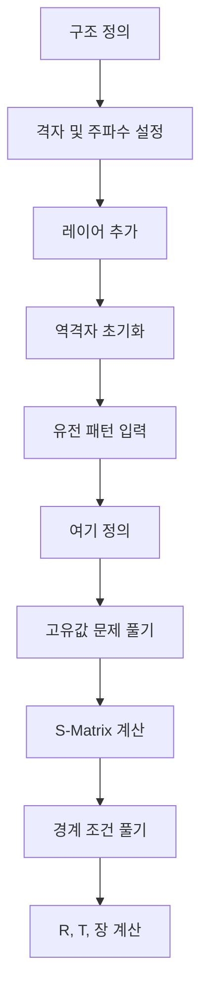

# RCWA 소개

## 엄밀 결합파 해석이란?

**엄밀 결합파 해석(Rigorous Coupled Wave Analysis, RCWA)** 또는 **Fourier 모드 방법(Fourier Modal Method, FMM)** 은 주기 구조에서 Maxwell 방정식을 푸는 준해석적 방법입니다. 주기적 광결정 구조를 해석하는 가장 널리 사용되는 기법 중 하나입니다:

- **회절 격자**: 분광기, 파장 분할 다중화기에 사용
- **광결정**: 빛의 전파를 제어하는 밴드갭 물질
- **메타표면**: 파면 제어를 위한 서브파장 구조 표면
- **태양전지**: 광 포획을 위한 주기적 텍스처
- **반사방지 코팅**: 나방 눈 구조
- **광학 필터**: 파장 선택 소자

## 왜 RCWA인가?

### 장점

**엄밀한 해**
:   근사 방법(광선 추적, 스칼라 회절)과 달리, RCWA는 Maxwell 방정식을 정확하게(수치 정밀도 내에서) 풉니다. 이는 다음에 중요합니다:

    - 광선 광학이 실패하는 서브파장 구조
    - 높은 굴절률 대비
    - 근접장 효과
    - 회절 차수 간 강한 결합

**효율성**
:   주기 구조의 경우, RCWA는 유한요소법이나 FDTD 방법보다 훨씬 빠릅니다:

    - 주기성이 3D 문제를 단위 셀 해석으로 축소
    - Fourier 표현이 부드러운 특징을 효율적으로 처리
    - 큰 계산 영역을 메시할 필요 없음

**유연성**
:   처리 가능:

    - 임의의 2D 주기 패턴
    - 다른 주기를 가진 다층 구조(초격자)
    - 등방성 및 이방성 재료
    - 임의 각도의 비스듬한 입사

### RCWA를 사용해야 할 때

✅ **RCWA가 이상적인 경우:**

- 2D 주기성을 가진 구조(측방향으로 무한)
- 스펙트럼 해석(주파수 스윕)
- 각도 분해 측정
- 명확하게 정의된 레이어를 가진 구조(각 레이어에서 z-불변)
- 최적화 문제(GRCWA의 autograd 기능 사용)

❌ **대안을 고려해야 할 때:**

- 비주기 구조 → FDTD, FEM 사용
- 3D 임의 형상 → FDTD, FEM 사용
- 초광대역 시뮬레이션 → FDTD 사용(RCWA는 주파수 스윕 필요)
- 비선형 광학 → 비선형 FDTD/FEM 사용

## 물리적 그림

### 입사파

평면파가 각도 $(\theta, \phi)$로 주기 구조에 입사합니다:

$$
\mathbf{E}_{\text{inc}} = \mathbf{E}_0 e^{i(\mathbf{k} \cdot \mathbf{r} - \omega t)}
$$

여기서:

- $\mathbf{k} = k_x \hat{x} + k_y \hat{y} + k_z \hat{z}$는 파동 벡터
- $\omega = 2\pi f$는 각주파수
- $\theta$는 극각(z축으로부터)
- $\phi$는 방위각(xy 평면에서)

### 주기 구조

구조는 x와 y에 주기적인 유전함수 $\varepsilon(\mathbf{r})$를 가집니다:

$$
\varepsilon(\mathbf{r} + \mathbf{L}_1) = \varepsilon(\mathbf{r})
$$

$$
\varepsilon(\mathbf{r} + \mathbf{L}_2) = \varepsilon(\mathbf{r})
$$

여기서 $\mathbf{L}_1$과 $\mathbf{L}_2$는 격자 벡터입니다.

<div align="center">
  
  <p><em>그림: 다층 주기 구조. 각 레이어는 다른 2D 주기 패턴을 가질 수 있습니다.</em></p>
</div>

### 회절 차수

주기성으로 인해, 입사파는 역격자 벡터 $\mathbf{G}_{mn}$로 특징지어지는 회절 차수와 결합됩니다:

$$
\mathbf{k}_{mn} = \mathbf{k}_{\parallel,0} + \mathbf{G}_{mn}
$$

여기서:

- $(m, n)$은 정수 인덱스
- $\mathbf{k}_{\parallel,0} = k_x \hat{x} + k_y \hat{y}$는 입사파의 면내 운동량
- $\mathbf{G}_{mn} = m\mathbf{K}_1 + n\mathbf{K}_2$는 역격자 벡터

각 회절 차수는 다른 각도로 전파하며, 구조에서 전력을 멀리 운반합니다.

### 레이어별 해석

RCWA는 구조를 레이어로 나눕니다:

1. **균일 외부 영역**(입력/출력): 해석적으로 풀 수 있음
2. **패턴 레이어**: 각 레이어는 일정한 z 프로파일을 가지지만 2D 주기 패턴
3. **균일 내부 레이어**: 간단한 해석적 해

각 레이어 내에서, 장은 Fourier 급수(고조파)로 전개됩니다:

$$
\mathbf{E}(\mathbf{r}) = \sum_{m,n} \mathbf{E}_{mn}(z) e^{i\mathbf{k}_{mn} \cdot \mathbf{r}_{\parallel}}
$$

## 주요 개념

### Bloch 정리

주기 구조에서, 전자기 모드는 Bloch 정리를 만족합니다:

$$
\mathbf{E}(\mathbf{r} + \mathbf{L}) = e^{i\mathbf{k} \cdot \mathbf{L}} \mathbf{E}(\mathbf{r})
$$

이를 통해 하나의 단위 셀 내에서만 풀고 경계 조건을 사용하여 전체 해를 구성할 수 있습니다.

### 소멸파 vs 전파 모드

각 회절 차수 $(m,n)$은 파동 벡터의 $z$ 성분을 가집니다:

$$
k_{z,mn} = \sqrt{\varepsilon \omega^2 - k_{x,mn}^2 - k_{y,mn}^2}
$$

- **전파 모드**: $k_z$가 실수 → 원거리장으로 전력 운반
- **소멸파**: $k_z$가 허수 → 지수적으로 감쇠, 근접장 에너지 저장

높은 회절 차수는 일반적으로 소멸파이지만, 정확한 근접장 계산을 위해 포함되어야 합니다.

### 에너지 보존

무손실 구조의 경우, 에너지는 보존되어야 합니다:

$$
R + T = 1
$$

여기서:

- $R$ = 총 반사 전력
- $T$ = 총 투과 전력

이는 수렴성에 대한 수치적 검증 역할을 합니다.

## RCWA 작업 흐름



### 단계별 프로세스

1. **형상 정의**: 격자 벡터, 레이어 두께
2. **RCWA 객체 설정**: 주파수, 입사각, 절단 차수
3. **레이어 추가**: 균일 또는 패턴
4. **초기화**: 역격자 계산
5. **패턴 입력**: 패턴 레이어의 경우, ε(x,y) 제공
6. **여기 설정**: 평면파 진폭 및 편광
7. **풀기**: RCWA가 반사, 투과, 장을 계산

## GRCWA의 특별한 점

### 표준 RCWA
```python
# R, T 계산
R, T = rcwa_solve(structure, freq)
```

### Autograd를 사용한 GRCWA
```python
import autograd.numpy as np
from autograd import grad

def objective(epsilon):
    R, T = grcwa_solve(structure, epsilon, freq)
    return -R  # 반사 최대화

# 자동 경사도!
grad_objective = grad(objective)
gradient = grad_objective(epsilon)
```

경사도를 자동으로 계산하는 기능은 다음을 가능하게 합니다:

- **위상 최적화**: 픽셀 단위로 임의 패턴 설계
- **역설계**: 목표 스펙트럼에서 시작하여 구조 최적화
- **빠른 프로토타이핑**: 수동으로 수반 방정식을 유도할 필요 없음
- **복잡한 목적함수**: 다목적 함수를 쉽게 최적화

## 다른 방법과의 비교

| 방법 | 차원 | 속도 | 유연성 | 원거리장 | 근접장 |
|--------|---------------|-------- |-------------|-----------|------------|
| **RCWA** | 2D 주기 | 빠름 | 주기만 | ✅ 우수 | ✅ 좋음 |
| **FDTD** | 2D/3D | 보통 | 모든 형상 | ✅ 좋음 | ✅ 우수 |
| **FEM** | 2D/3D | 느림 | 모든 형상 | ⚠️ PML 필요 | ✅ 우수 |
| **광선 추적** | 3D | 매우 빠름 | 모든 형상 | ✅ 좋음 | ❌ 무효 |
| **T-Matrix** | 3D 입자 | 빠름 | 회전타원체 | ✅ 우수 | ⚠️ 제한적 |

## 물리 단위 및 규약

GRCWA는 **자연 단위**를 사용합니다:

$$
\varepsilon_0 = \mu_0 = c = 1
$$

이는 다음을 의미합니다:

- **길이**: 임의(자신의 단위 선택, 예: μm)
- **주파수**: $f = c/\lambda = 1/\lambda$(길이 단위 기준)
- **시간 고조파**: $e^{-i\omega t}$ 규약
- **임피던스**: $Z = \sqrt{\mu_0/\varepsilon_0} = 1$

### 예제

파장 $\lambda = 1.5$ μm에서의 구조:

```python
wavelength = 1.5  # μm
freq = 1.0 / wavelength  # freq = 0.6667 (c=1 단위에서)
```

모든 길이(격자 상수, 두께)도 μm 단위여야 합니다.

## 다음 단계

이제 RCWA가 무엇이고 GRCWA가 무엇을 제공하는지 이해했으므로, 다음으로 진행하세요:

- **[설치](installation.md)**: GRCWA 설치
- **[빠른 시작](quickstart.md)**: 첫 번째 시뮬레이션 실행
- **[물리 원리](theory/principles.md)**: 물리학 깊이 있게 이해
- **[수학 공식](theory/mathematics.md)**: 방정식 이해
