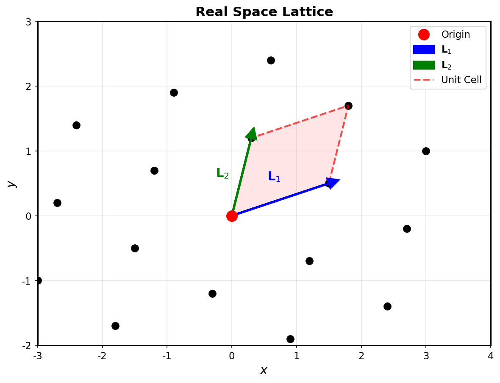
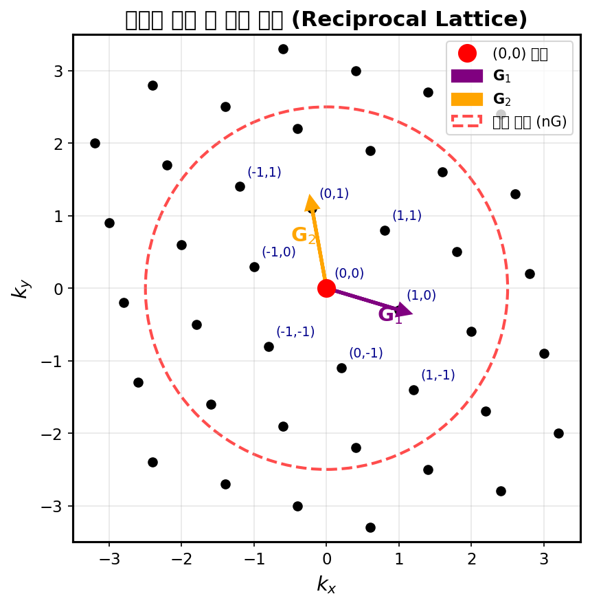
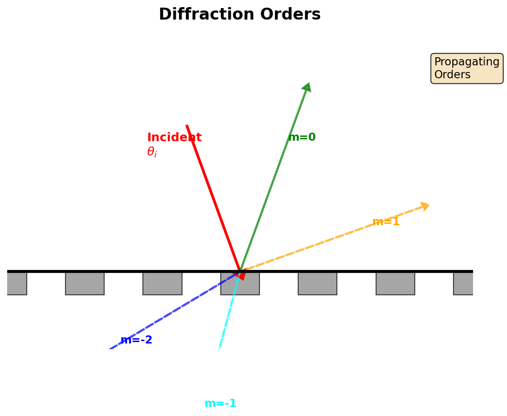
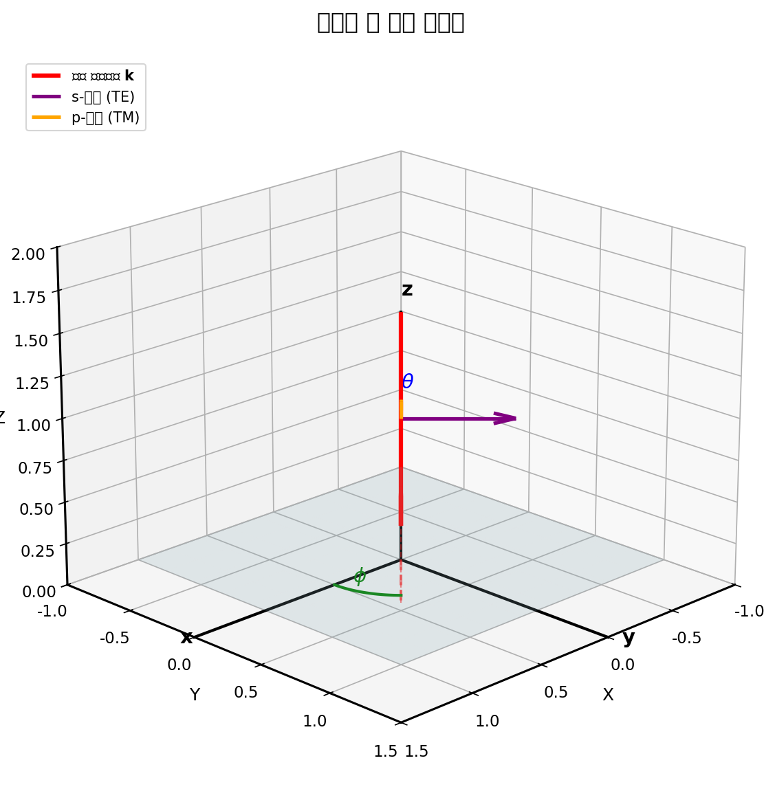
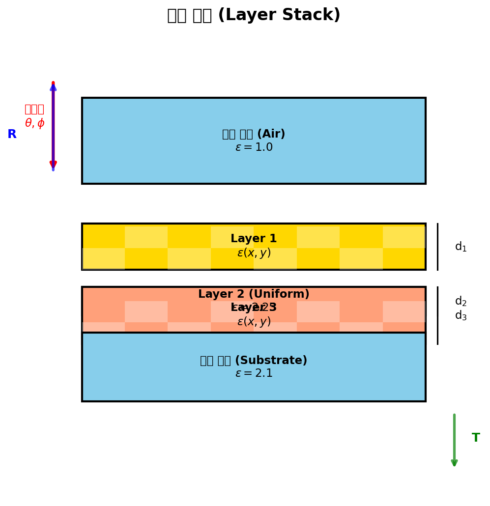

# RCWA의 물리적 원리

이 페이지는 엄밀 결합파 해석(RCWA)의 배후 물리학을 설명합니다.

## Maxwell 방정식

RCWA는 시간 조화 장에 대한 Maxwell 방정식을 $e^{-i\omega t}$ 규약으로 풉니다:

### 회전 방정식

$$
\nabla \times \mathbf{E} = i\omega \mathbf{B} = i\omega \mu \mathbf{H}
$$

$$
\nabla \times \mathbf{H} = -i\omega \mathbf{D} = -i\omega \varepsilon \mathbf{E}
$$

### 발산 방정식

$$
\nabla \cdot \mathbf{D} = \nabla \cdot (\varepsilon \mathbf{E}) = 0
$$

$$
\nabla \cdot \mathbf{B} = \nabla \cdot (\mu \mathbf{H}) = 0
$$

GRCWA의 자연 단위계: $\varepsilon_0 = \mu_0 = c = 1$

## 파동 방정식

Maxwell 회전 방정식으로부터 벡터 파동 방정식을 유도할 수 있습니다:

$$
\nabla \times \nabla \times \mathbf{E} - \omega^2 \varepsilon \mathbf{E} = 0
$$

$$
\nabla \times \nabla \times \mathbf{H} - \omega^2 \mu \mathbf{H} = 0
$$

항등식 $\nabla \times \nabla \times \mathbf{F} = \nabla(\nabla \cdot \mathbf{F}) - \nabla^2 \mathbf{F}$를 사용하면:

균일 매질에서 **E-장**의 경우:
$$
\nabla^2 \mathbf{E} + \omega^2 \varepsilon \mathbf{E} = 0
$$

이는 파수 $k = \omega\sqrt{\varepsilon}$를 갖는 Helmholtz 방정식입니다.

## 주기 구조

### 격자 주기성

광결정은 2D 주기성을 가집니다:

$$
\varepsilon(\mathbf{r} + m\mathbf{L}_1 + n\mathbf{L}_2) = \varepsilon(\mathbf{r})
$$

여기서 $m, n \in \mathbb{Z}$이고 $\mathbf{L}_1, \mathbf{L}_2$는 격자 벡터입니다.

!!! note "GRCWA에서"
    격자 벡터는 시뮬레이션 객체 생성 시 정의됩니다:
    ```python
    obj = grcwa.obj(nG, L1=[a, 0], L2=[0, b], freq, theta, phi)
    ```
    여기서 `L1`, `L2`는 격자 벡터 $\mathbf{L}_1, \mathbf{L}_2$입니다.

**격자 예시:**

- **정사각**: $\mathbf{L}_1 = a\hat{x}$, $\mathbf{L}_2 = a\hat{y}$
- **직사각**: $\mathbf{L}_1 = a\hat{x}$, $\mathbf{L}_2 = b\hat{y}$
- **육각**: $\mathbf{L}_1 = a\hat{x}$, $\mathbf{L}_2 = a(\frac{1}{2}\hat{x} + \frac{\sqrt{3}}{2}\hat{y})$



*실공간 격자: 격자 벡터 $\mathbf{L}_1$, $\mathbf{L}_2$와 단위 셀이 보입니다.*

### 역격자

역격자 벡터는 다음을 만족합니다:

$$
\mathbf{K}_i \cdot \mathbf{L}_j = 2\pi \delta_{ij}
$$

3D에 내장된 2D 격자의 경우:

$$
\mathbf{K}_1 = 2\pi \frac{\mathbf{L}_2 \times \hat{z}}{|\mathbf{L}_1 \times \mathbf{L}_2 \cdot \hat{z}|}
$$

$$
\mathbf{K}_2 = 2\pi \frac{\hat{z} \times \mathbf{L}_1}{|\mathbf{L}_1 \times \mathbf{L}_2 \cdot \hat{z}|}
$$

역격자 벡터는:

$$
\mathbf{G}_{mn} = m\mathbf{K}_1 + n\mathbf{K}_2, \quad m,n \in \mathbb{Z}
$$

!!! note "GRCWA에서"
    역격자 벡터는 `Init_Setup()` 호출 시 자동으로 계산됩니다:
    ```python
    obj.Init_Setup()  # 역격자 계산

    # 접근:
    K1 = obj.Lk1  # 역격자 벡터 1
    K2 = obj.Lk2  # 역격자 벡터 2
    G_indices = obj.G  # (m,n) 인덱스 배열
    ```



*역격자 공간: 회절 차수 $(m,n)$과 역격자 벡터 $\mathbf{G}_1$, $\mathbf{G}_2$가 표시되어 있습니다. 빨간 점선 원은 절단 영역(nG)을 나타냅니다.*

## Bloch 정리

### Bloch 파

주기 구조에서 전자기 모드는 **Bloch 파**입니다:

$$
\mathbf{E}(\mathbf{r}) = e^{i\mathbf{k}_\parallel \cdot \mathbf{r}_\parallel} \mathbf{u}(\mathbf{r})
$$

여기서:

- $\mathbf{k}_\parallel = k_x\hat{x} + k_y\hat{y}$는 Bloch 파동 벡터
- $\mathbf{u}(\mathbf{r})$는 구조와 동일한 주기성을 가집니다: $\mathbf{u}(\mathbf{r} + \mathbf{L}) = \mathbf{u}(\mathbf{r})$

### Floquet-Bloch 정리

$\mathbf{u}(\mathbf{r})$가 주기적이므로 Fourier 급수로 전개할 수 있습니다:

$$
\mathbf{E}(\mathbf{r}) = e^{i\mathbf{k}_\parallel \cdot \mathbf{r}_\parallel} \sum_{mn} \mathbf{E}_{mn}(z) e^{i\mathbf{G}_{mn} \cdot \mathbf{r}_\parallel}
$$

$$
= \sum_{mn} \mathbf{E}_{mn}(z) e^{i(\mathbf{k}_\parallel + \mathbf{G}_{mn}) \cdot \mathbf{r}_\parallel}
$$

**Bloch 파동 벡터** 정의:

$$
\mathbf{k}_{mn,\parallel} = \mathbf{k}_\parallel + \mathbf{G}_{mn}
$$

각 $(m,n)$은 **회절 차수** 또는 **Floquet 조화함수**입니다.

## 회절과 전파

### 면내 파동 벡터

$\varepsilon_{\text{in}}$을 갖는 매질에서 각도 $(\theta, \phi)$로 입사하는 평면파의 경우:

$$
k_{x0} = \omega\sqrt{\varepsilon_{\text{in}}} \sin\theta \cos\phi
$$

$$
k_{y0} = \omega\sqrt{\varepsilon_{\text{in}}} \sin\theta \sin\phi
$$

각 회절 차수는 면내 파동 벡터를 가집니다:

$$
k_{x,mn} = k_{x0} + G_{x,mn}
$$

$$
k_{y,mn} = k_{y0} + G_{y,mn}
$$

!!! note "GRCWA에서"
    각 회절 차수의 파동 벡터는 `Init_Setup()` 후 접근할 수 있습니다:
    ```python
    kx_all = obj.kx  # 모든 차수의 kx, 형상: (nG,)
    ky_all = obj.ky  # 모든 차수의 ky, 형상: (nG,)
    ```

### 파동 벡터의 Z-성분

$\varepsilon$을 갖는 매질에서 분산 관계로부터:

$$
k_{x,mn}^2 + k_{y,mn}^2 + k_{z,mn}^2 = \varepsilon \omega^2
$$

따라서:

$$
k_{z,mn} = \pm\sqrt{\varepsilon \omega^2 - k_{x,mn}^2 - k_{y,mn}^2}
$$

**두 가지 경우:**

1. **전파 모드**: $k_{x,mn}^2 + k_{y,mn}^2 < \varepsilon\omega^2$ → $k_z$는 실수
   - 원거리장으로 파워를 운반
   - 반사/투과에 기여

2. **소산 모드**: $k_{x,mn}^2 + k_{y,mn}^2 > \varepsilon\omega^2$ → $k_z$는 허수
   - 지수적으로 감쇠: $e^{-|\text{Im}(k_z)|z}$
   - 근접장 에너지를 저장
   - 장 분포에는 중요하지만 R/T에는 기여하지 않음

### 물리적 해석

회절 차수를 주기 구조에 의해 생성되는 서로 다른 "빔"으로 생각하세요:

- **0차** $(m=0, n=0)$: 주 투과/반사 빔
- **고차** $(m,n \neq 0)$: $\mathbf{k}_{mn}$에 의해 결정되는 각도로 회절된 빔

낮은 주파수(긴 파장)에서는 대부분의 차수가 소산됩니다. 높은 주파수에서는 많은 차수가 전파할 수 있습니다.



*회절 차수: 주기 격자에 의해 생성된 다양한 회절 차수 $(m)$가 보입니다. 각 차수는 서로 다른 각도로 전파됩니다.*

## 편광

### S 및 P 편광

평면파의 경우 두 개의 직교 편광으로 분해합니다:

**S-편광 (TE)**: 입사면에 수직인 전기장

- $\mathbf{k} \parallel \hat{z}$인 수직 입사의 경우: $\mathbf{E} \parallel \hat{x}$ 또는 $\hat{y}$

**P-편광 (TM)**: 입사면에 수직인 자기장

- 입사면 내의 전기장

### 일반 편광 상태

임의의 편광은 중첩입니다:

$$
\mathbf{E} = A_s e^{i\phi_s} \hat{s} + A_p e^{i\phi_p} \hat{p}
$$

**선형 편광**: $\phi_p - \phi_s = 0$ 또는 $\pi$

**원형 편광**: $A_p = A_s$, $\phi_p - \phi_s = \pm\pi/2$

**타원 편광**: 일반적인 경우

!!! note "GRCWA에서"
    평면파 여기는 `MakeExcitationPlanewave()`로 정의됩니다:
    ```python
    # P-편광
    obj.MakeExcitationPlanewave(p_amp=1, p_phase=0, s_amp=0, s_phase=0)

    # 좌원 편광
    obj.MakeExcitationPlanewave(p_amp=1, p_phase=0, s_amp=1, s_phase=np.pi/2)
    ```



*입사 기하학: 극각 $\theta$, 방위각 $\phi$, 그리고 s-편광(TE) 및 p-편광(TM) 방향이 표시되어 있습니다.*

## 에너지 및 파워 흐름

### Poynting 벡터

시간 평균 Poynting 벡터는:

$$
\langle\mathbf{S}\rangle = \frac{1}{2} \text{Re}(\mathbf{E} \times \mathbf{H}^*)
$$

이는 전자기 파워 흐름(단위 면적 단위 시간당 에너지)을 제공합니다.

### 각 차수의 파워

각 회절 차수 $(m,n)$에 대해:

$$
P_{mn} = \frac{1}{2} \text{Re}\left( E_{x,mn} H_{y,mn}^* - E_{y,mn} H_{x,mn}^* \right) \cdot \frac{A_{\text{cell}}}{\cos\theta_{mn}}
$$

여기서:

- $A_{\text{cell}} = |\mathbf{L}_1 \times \mathbf{L}_2|$는 단위 셀 면적
- $\theta_{mn}$은 차수 $(m,n)$의 전파 각도

### 반사 및 투과

**전체 반사 파워**:

$$
R = \sum_{mn} \frac{P_{mn}^{\text{refl}}}{P_{\text{inc}}}
$$

**전체 투과 파워**:

$$
T = \sum_{mn} \frac{P_{mn}^{\text{trans}}}{P_{\text{inc}}}
$$

손실 없는 구조의 경우: $R + T = 1$ (에너지 보존)

!!! note "GRCWA에서"
    반사 및 투과는 `RT_Solve()`로 계산됩니다:
    ```python
    # 전체 R, T
    R, T = obj.RT_Solve(normalize=1)
    print(f"R+T = {R+T}")  # 에너지 보존 확인

    # 차수별 R, T
    Ri, Ti = obj.RT_Solve(normalize=1, byorder=1)
    print(f"0차 반사: {Ri[0]}")
    ```

## 경계 조건

### 접선 장 연속성

레이어 간 경계면에서 접선 성분은 연속이어야 합니다:

$$
\mathbf{n} \times (\mathbf{E}_1 - \mathbf{E}_2) = 0
$$

$$
\mathbf{n} \times (\mathbf{H}_1 - \mathbf{H}_2) = 0
$$

여기서 $\mathbf{n}$은 경계면 법선입니다.

수평 경계면 ($\mathbf{n} = \hat{z}$)의 경우:

$$
E_x, E_y, H_x, H_y \text{ 연속}
$$

### 법선 장 불연속성

법선 성분은 다음을 만족합니다:

$$
\mathbf{n} \cdot (\varepsilon_1 \mathbf{E}_1 - \varepsilon_2 \mathbf{E}_2) = 0
$$

$$
\mathbf{n} \cdot (\mu_1 \mathbf{H}_1 - \mu_2 \mathbf{H}_2) = 0
$$

유전체 대비의 경우 $D_z = \varepsilon E_z$는 연속이지만 $E_z$는 그렇지 않습니다.

## RCWA의 레이어 구조

### 균일 레이어

상수 $\varepsilon(z) = \varepsilon_0$를 갖는 레이어의 경우:

- 해석적 고유모드 해
- 모드는 전방/후방 전파 평면파
- 빠르고 안정적

!!! note "GRCWA에서"
    ```python
    obj.Add_LayerUniform(thickness, epsilon)
    ```

### 패턴 레이어

$\varepsilon(x,y,z) = \varepsilon(x,y)$ (z-불변)를 갖는 레이어의 경우:

- 고유값 문제를 수치적으로 풀어야 함
- 모드는 서로 다른 $k_z$를 갖는 Bloch 파
- 계산 비용이 더 높음

!!! note "GRCWA에서"
    ```python
    # 패턴 레이어 추가
    obj.Add_LayerGrid(thickness, Nx, Ny)

    # 나중에 유전 패턴 입력
    obj.GridLayer_geteps(epsilon_pattern.flatten())
    ```

### 레이어 적층

RCWA는 구조를 스택으로 취급합니다:

```
입력 영역 (균일)
↓
레이어 1 (균일 또는 패턴)
↓
레이어 2 (균일 또는 패턴)
↓
...
↓
레이어 N (균일 또는 패턴)
↓
출력 영역 (균일)
```

각 레이어는 독립적으로 풀린 다음 경계 조건을 통해 결합됩니다.



*다층 구조: 여러 레이어로 구성된 RCWA 시뮬레이션 구조. 입사파, 반사파(R), 투과파(T)가 표시되어 있습니다. 각 레이어는 균일하거나 패턴을 가질 수 있습니다.*

## 절단 및 수렴

### Fourier 절단

실제로는 무한 Fourier 급수를 절단합니다:

$$
\mathbf{E}(\mathbf{r}) = \sum_{m=-M}^{M} \sum_{n=-N}^{N} \mathbf{E}_{mn}(z) e^{i\mathbf{k}_{mn} \cdot \mathbf{r}_\parallel}
$$

절단 차수 $N_G = (2M+1)(2N+1)$은 정확도와 계산 비용을 결정합니다.

### 수렴 거동

**매끄러운 특징**: 빠른 수렴, 작은 $N_G$로 충분

**날카로운 특징**: 느린 수렴, 큰 $N_G$ 필요 (Gibbs 현상)

**깊은 아파장**: 매우 큰 $N_G$가 필요할 수 있음

**경험 법칙**: $N_G \sim 101$로 시작하여 결과가 수렴할 때까지 증가

## 물리적 통찰

### RCWA가 작동하는 이유

1. **주기성이 차원을 감소**: 3D 문제 → 단위 셀 + Bloch 정리
2. **Fourier 표현**: 매끄러운 유전 프로파일에 효율적
3. **레이어별**: 복잡한 3D 구조 → 2D 문제의 스택
4. **엄밀함**: Maxwell 방정식을 정확하게 풉니다 (절단 내에서)

### RCWA가 뛰어난 경우

- **고Q 공진**: 날카로운 스펙트럼 특징 포착
- **아파장 구조**: 근접장을 올바르게 처리
- **다중 회절 차수**: 각 차수를 개별적으로 분석
- **임의 패턴**: 형상에 제한 없음 (그리드 방법 사용)

### 한계

- **주기성 필요**: 고립된 물체를 직접 시뮬레이션할 수 없음 (슈퍼셀 사용)
- **날카로운 가장자리의 수렴**: 높은 절단 차수가 필요할 수 있음
- **주파수 영역**: 시간 영역은 Fourier 변환 필요

## 요약

RCWA는 주기 구조에 대한 Maxwell 방정식을 다음과 같이 풉니다:

1. Floquet-Bloch 모드(회절 차수)로 장 전개
2. 유전 프로파일의 Fourier 변환
3. 각 레이어에 대한 고유값 문제 풀기
4. 레이어 간 경계 조건 일치
5. 각 회절 차수의 파워 흐름 계산

결과는 주기적 광결정 구조를 시뮬레이션하는 엄밀하고 효율적인 방법입니다.

## 다음 주제

- **[수학적 공식화](mathematics.md)**: 상세한 방정식 및 유도
- **[RCWA 알고리즘](algorithm.md)**: 단계별 계산 절차
- **[기본 개념](../guide/concepts.md)**: 실용적인 구현 가이드
